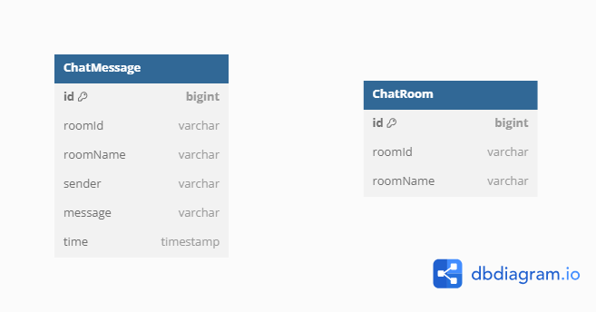

# 익명 채팅 서비스
로그인 없이 누구나 익명으로 채팅에 참여할 수 있는 실시간 채팅 서비스입니다. 
웹소켓을 사용해 클라이언트와 서버 간의 실시간 양방향 통신을 구현하였으며,
사용자는 사이트에 접속하여 생성된 채팅 방을 선택하면 즉시 해당 방의 대화 내용을 확인할 수 있습니다.

또한, 여러 서버 인스턴스가 떠 있는 분산 환경에서 웹소켓만으로는 연결된 서버 인스턴스에 따라
다른 사용자 경험이 발생할 수 있는데 이를 방지하기 위해 레디스의 pub/sub 을 이용하였습니다.
이를 통해, 서버에 연결된 클라이언트가 보내는 메시지가 모든 서버 인스턴스에 실시간으로 전달되고,
모든 사용자는 같은 채팅 내용을 확인할 수 있습니다.

# ERD


# 주요 구현
### 분산환경에서 데이터 정합성 보장
- 채널 구독
  - 메세지를 보낼 때 채널을 구독하지 않으면 데이터는 전송되지만 Listener가 메세지를 읽지 못해
    메세지가 유실됩니다. 이를 막기 위해 addMessageListener이 필요합니다
- 메세지 웹소켓으로 전달
  - MessageListener를 구현하여 onMessage가 존재하면 레디스에 메세지 발행 시 해당 메서드가 실행됩니다.
    이 때, messagingTemplate를 통해 값을 웹소켓으로 전달해주지 않으면 화면에서 채팅 데이터를 전달받을 수 없습니다.
- DB 데이터 저장
  - 채팅 데이터의 유실을 막기 위해 DB에 데이터를 저장하였습니다. 레디스가 읽지 못하면 유저들도 데이터를 볼 수 없기에
    레디스의 subscribe가 완료되고 저장로직을 수행하였습니다.

```java
// ChatService
public void sendMessage(ChatMessageDto message) {
    // 요청한 Channel 을 구독.
    redisMessageListenerContainer.addMessageListener(redisSubscribeListener, new ChannelTopic("chat"));

    // Redis에  Message 전송
    redisPublisher.publish(new ChannelTopic("chat"), message);
}

// RedisSubscribeListener
public void onMessage(Message message, byte[] pattern) {
    try {
        String publishMessage = redisTemplate.getStringSerializer().deserialize(message.getBody());
    
        ChatMessageDto messageDto = objectMapper.readValue(publishMessage, ChatMessageDto.class);
    
        log.info("Redis Subscribe Channel : " + messageDto.getRoomId());
        log.info("Redis SUB Message : {}", publishMessage);
    
        // 레디스로 받은 데이터를 웹소켓에 전송
        messagingTemplate.convertAndSend("/topic/public", messageDto);
        chatRepository.save(new ChatMessage(messageDto));
    } catch (JsonProcessingException e) {
        log.error(e.getMessage());
    }
}
```

# 구현 화면


